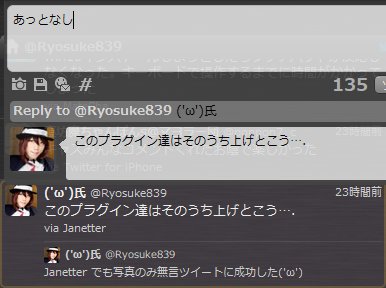

# Self-reply plugin for Janetter

自分自身にリプライする際， @screen_name を消しても reply_to が消えないようにします．

## Author
Ryosuke839 ([@Ryosuke839](https://twitter.com/Ryosuke839))

## Installation
Put `selfreply.js` to `%ProgramFiles%\Janetter2\Theme\Common\js\plugins\` and restart Jantter to install  
(Replace `%ProgramFiles%` with `%ProgramFiles(x86)%` for 64-bit windows)
